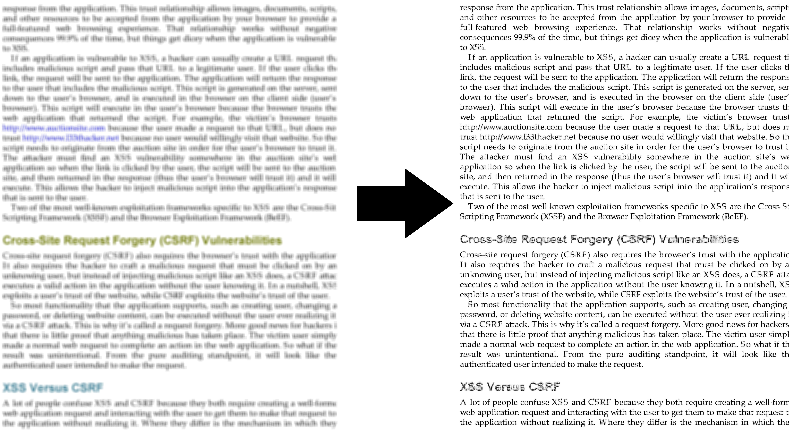
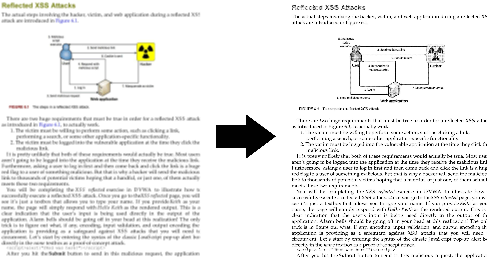
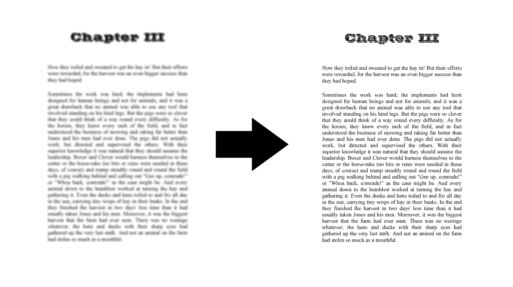

I created a Deep Learning algorithm for recognizing blurred documents (RBD).
This model is an autoencoder convolutional network created by Keras in Python using the TensorFlow library.
You can see some examples below.
One special advantage of this model is the fact that it can recognize images of various sizes. The way this model works is by taking images of any size and converting them into 64x64 pieces and then recognizing them, and finally connecting these pieces together to display the final image.
You can find the codes at https://github.com/AryaKoureshi/RBD

If you would like to know more about the model, please contact me.
#deeplearning
#python
#tensorflow
#keras
#AI
#RBD

  
  
  

