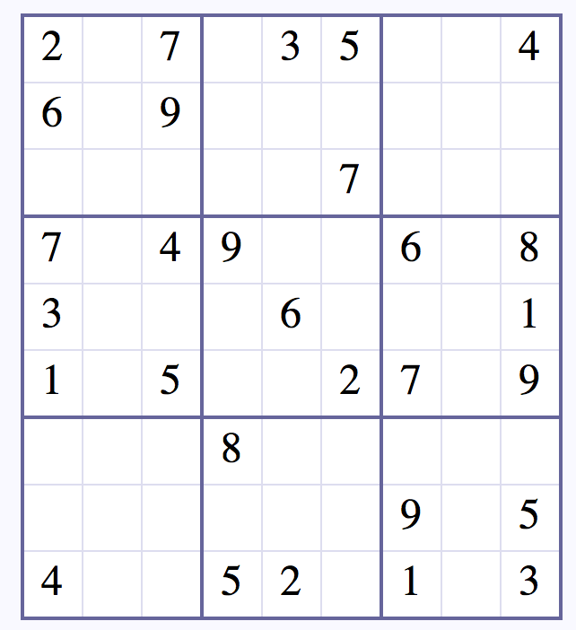
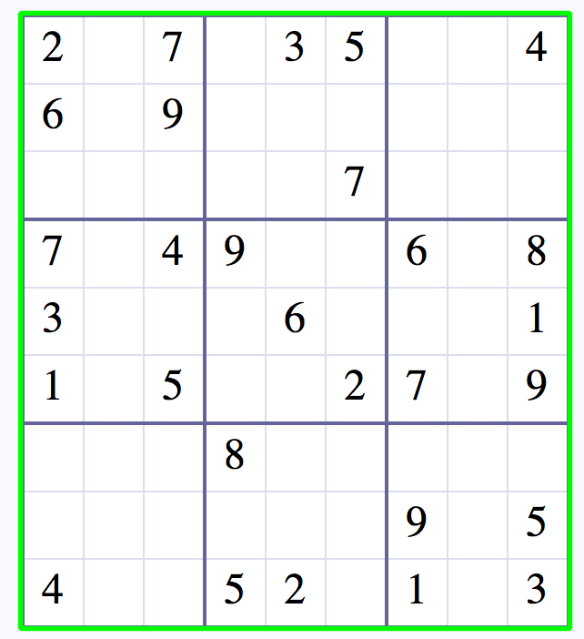
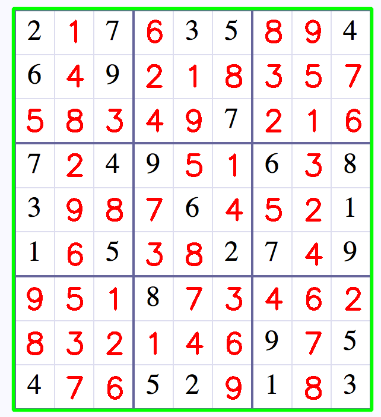

SolSudo is my Sudoku solver made with Artificial Intelligence and Deep Learning.
I saw a GIF a few days ago that showed an application using a camera that could solve Sudoku that I found intriguing, so I decided to solve Sudoku with Artificial Intelligence and Deep Learning that was a new experience for me.
One of the features of this new experience is its intelligent solution method. In reality, in this method, the model predicts the blank digits, and when each level is completed, filled blanks are placed one after the other. Each time a digit is filled, new sudoku will be fed to the solver to determine the next digit. Again and again, until there is no blank.
One of the features of this program is detecting sudoku from an image, and filling in the blank digits. You need Tesseract to do this, however, which may cause problems. Due to this, I devised another method, in which the Sudoku numbers are entered one by one, and 0 is used for empty digits.
Below you can see an example of Sudoku, its detection, and solution.
Download Link: [GitHub](https://github.com/AryaKoureshi/SolSudo)

You can see this post on my [Linkedin](https://www.linkedin.com/posts/arya-koureshi_deeplearning-python-tensorflow-activity-6711641409658716160-kdSD) account or contact me to receive the model and know-how work this codes.
#deeplearning #python #tensorflow #keras #machinelearning #algorithms #artificialintelligence

<figure class="figure">
  
  <figcaption class="figure-caption">Sudoku</figcaption>
</figure>
<figure class="figure">
  
  <figcaption class="figure-caption">Detected</figcaption>
</figure>
<figure class="figure">
  
  <figcaption class="figure-caption">Solved</figcaption>
</figure>
