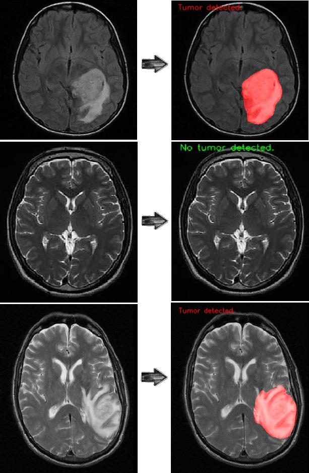

Topic: Brain tumor detection

Abstract: Brain tumor detection with segmentation from MRI images using CNN and Unet models. These deep neural networks are implemented with Keras functional API.
The CNN model is used to detect whether a tumor is there or not. After 15 epochs of training, the calculated accuracy is about 99.6%.
The U-net model is used to segment tumors in MRI images of the brain. After 10 epochs of training, the calculated accuracy is about 98%.

Use the trained models to detect and segment tumors on brain MRI images. The result is satisfactory.

You can download my U-net trained model from: [Unet](https://drive.google.com/drive/folders/1qt7l3HOGIwOguWsMKc5fuwG2NGiGOucf?usp=sharing) and CNN trained model from: [CNN](https://drive.google.com/drive/folders/1fXFzMwNG6HrbNp6-GASAgeybeSB3JWCd?usp=sharing)

Contact me if you need any help in making it work.
To access the codes, refer to my GitHub.

[Github](https://github.com/AryaKoureshi/Brain-tumor-detection)

[Linkedin](https://www.linkedin.com/posts/arya-koureshi_brainabrtumor-mri-cnn-activity-6879823236830375936-0new)

<figure class="figure1">
  
  <figcaption class="figure-caption">Results</figcaption>
</figure>

